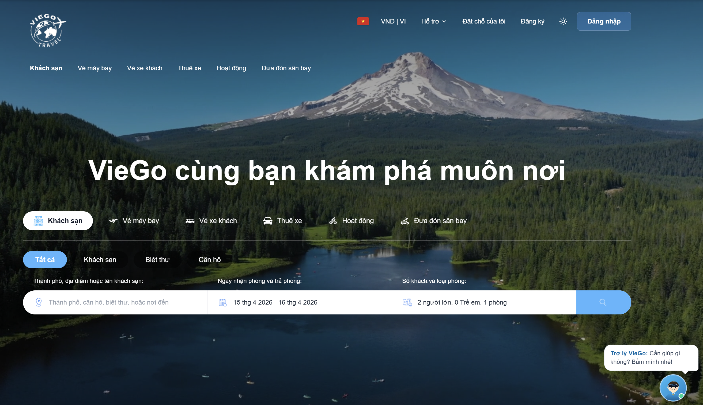
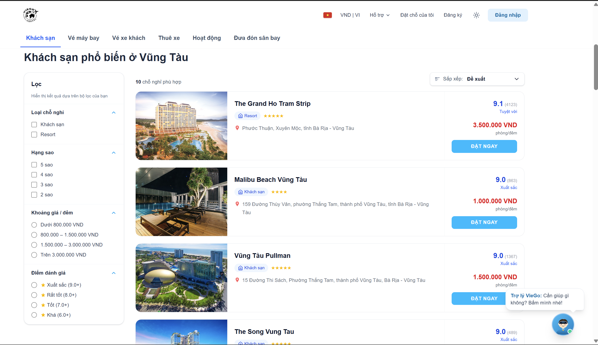
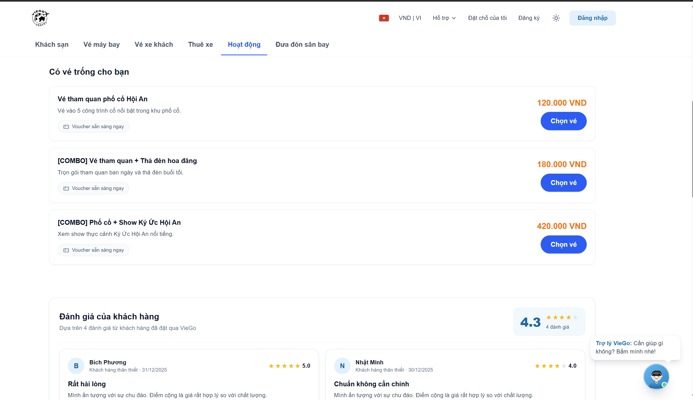

# VieGo — Website Booking Du Lịch

## 1. Thông tin nhóm

- **Tên nhóm:** Nhóm 01
- **Chủ đề:** Booking du lịch
- **Thương hiệu:** VieGo
- **Repository:** [nhom01_dulich_booking](https://github.com/vutronghuy020805-sys/nhom01_dulich_booking)

## 2. Thành viên

| Họ và tên | MSSV | Vai trò |
| --- | --- | --- |
| Vũ Trọng Huy | 24126090 | Frontend / Logic / Deploy |
| Tạ Bùi Thanh Huyền | 24126091 | UI / Frontend |
| Đinh Thị Như Ngọc | 24126150 | UI / Frontend |
| Dương Gia Khánh | 24126098 | Frontend |
| Nguyễn Thị Ngọc Hạnh | 24126059 | Frontend |
| Đỗ Hữu Nghĩa | 24126049 | Frontend |
| Nguyễn Ngọc Anh | 24126901 | Frontend |

> Các thành viên có thể chỉnh lại cột **Vai trò** cho khớp với phân công thực tế của nhóm.

## 3. Mô tả dự án

**VieGo** là nền tảng đặt dịch vụ du lịch trực tuyến, được xây dựng bằng **Next.js (App Router) + TailwindCSS**. Người dùng có thể tìm kiếm và đặt nhiều loại dịch vụ trong một flow thống nhất:

- Khách sạn, phòng nghỉ, biệt thự, căn hộ
- Tour du lịch và hoạt động (activities)
- Vé máy bay, vé xe khách
- Thuê xe tự lái, đưa đón sân bay
- Blog du lịch và hỗ trợ khách hàng

## 4. Tính năng nổi bật

- Giao diện responsive theo thiết kế Figma
- Điều hướng nhiều trang với App Router (Next.js 16)
- Trang chi tiết động cho phòng / tour với prerender tĩnh (SSG)
- Flow đặt dịch vụ → thanh toán → xác nhận
- Blog du lịch, trang giới thiệu, trang liên hệ
- Chatbot hỗ trợ cơ bản
- Deploy tự động lên **GitHub Pages** qua GitHub Actions (static export)

## 5. Link Figma

🎨 https://www.figma.com/design/1LxxWvGlAveJ6lVcgYgzfe/Booking-du-l%E1%BB%8Bch?node-id=0-1&p=f&t=Bn4igtVBdUimmqYG-0

## 6. Link GitHub Pages

🌐 https://vutronghuy020805-sys.github.io/nhom01_dulich_booking/

## 7. Hướng dẫn chạy local

```bash
# 1. Cài đặt dependencies
npm install

# 2. Chạy dev server (mặc định http://localhost:3000)
npm run dev

# 3. Build production (export tĩnh ra thư mục ./out)
npm run build
```

Yêu cầu: **Node.js ≥ 20**.

## 8. Ảnh chụp màn hình giao diện

### Trang chủ


### Danh sách phòng / chi tiết phòng


### Trang đặt vé / hoạt động


> Đặt 3 file ảnh trên vào thư mục `docs/` (tạo thư mục nếu chưa có) trước khi push, để các ảnh hiển thị đúng trên GitHub.

## 9. Cấu trúc deploy

- Build: `next build` với `output: 'export'`, `basePath: '/nhom01_dulich_booking'`, `trailingSlash: true`
- CI: [.github/workflows/deploy.yml](./.github/workflows/deploy.yml) tự build & deploy mỗi khi push vào `main`
- Hosting: GitHub Pages (Settings → Pages → Source: GitHub Actions)
